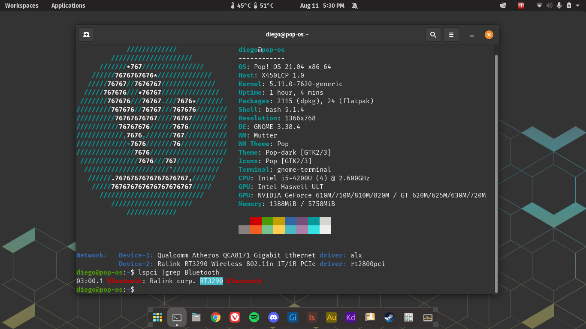
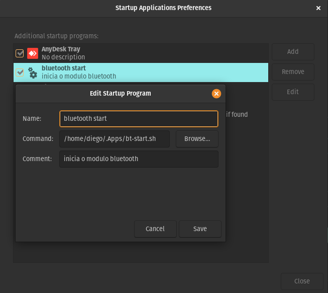

<br>

<h1 align="center">Driver Bluetooth Ralink-MediaTek RT3290</h1>

<br>

Este é um módulo do kernel Linux para um dispositivo sem fio Ralink RT3290.
Este módulo não tem suporte oficial da Mediatek. O suporte foi descontinuado.

<br>

<p align="center">
  
</p>

<h5 align="center"><em>Screenshot Pop!_OS 21.04 com driver BT RT3290</em></h5>

<br> <br>
 
### PPA rtbth dkms **[Link](https://launchpad.net/~blaze/+archive/ubuntu/rtbth-dkms)**.

<br>

*Atenção o PPA suporta vai até a versão Ubuntu 21.10 (impish)*  

*Testei no pop!_OS 21.04 e funciona na maioria das vezes mais esse modulo wifi-bt da ralink-mediatek é ruim o sinal wifi é fraco e o alcance do BT é baixo um dongle bt usb csr é superior a esse modulo wifi-bt, minha recomendação e o que eu vou fazer é trocar o placa wifi-bt*

<br>

```sh
# Adicionando PPA e instalando driver

sudo add-apt-repository ppa:blaze/rtbth-dkms
sudo apt-get update
sudo apt-install rtbth-dkms

# Reinicie o sistema

sudo modprobe rtbth
```
<br>

### Comandos extras

<br> 

```sh
# Init

# utilize esse comando para iniciar o driver bluetooth.
sudo modprobe rtbth


sudo rfkill list all
sudo rfkill unblock bluetooth

hcitool dev # check

# Switch off
sudo rfkill block bluetooth

# Switch on
sudo rfkill unblock bluetooth

# Shutdown
sudo pkill -2 rtbt
sudo rmmod rtbth
```
<br>

## bt-start.sh
É um pequeno shell script que faz o modulo BT iniciar junto com sistema, o sh roda o comando "sudo modprobe rtbth" basta trocar a palavra **senha** dentro do sh pela senha do seu usuário e adicionar o sh para iniciar com sistema.

<br>

<p align="center">
  
</p>

<br><br>